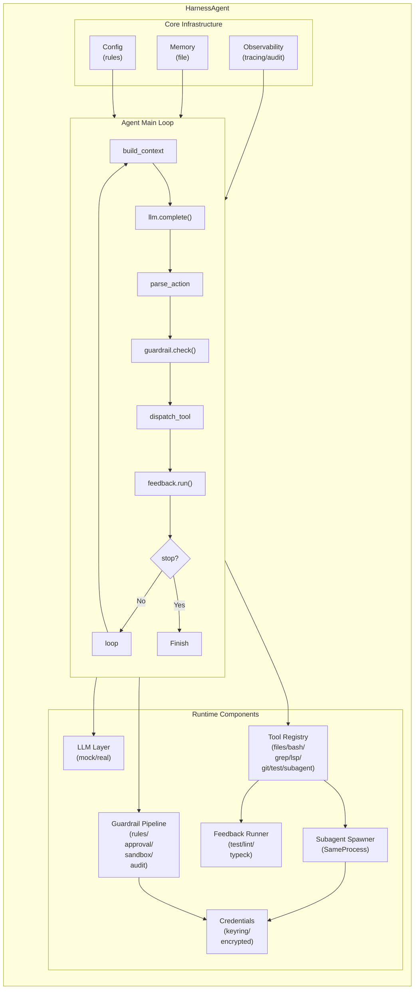

# AuV harness agent — Coding Agent Harness 设计文档

> 日期：2025-07-08（最后修订 2026-08-14）
> 项目：AI4SE 期末项目 · A · Coding Agent Harness（项目更名 **AuV harness agent**，简称 **AuV**；二进制名 `auv`，lib/包名与内部类型名保持 `harness_agent`）
> 语言：Rust (edition 2024)

---

## 1. 问题陈述

### 1.1 要解决什么问题

构建一个 **Coding Agent Harness**（AuV）——将 LLM 从"只能产生下一步设想"的推理引擎，封装成一台能稳定、可靠执行软件工程任务的完整系统。Harness 是 LLM（CPU）与外部世界之间的全部工程：工具分发、治理护栏、反馈闭环、记忆管理、上下文工程。最终交付形态为**交互式 REPL**（主要）+ **TUI 可视化面板** + **纯文本 CLI** 三种运行模式，无 Web 界面（见 §13 交付形态说明）。

### 1.2 目标用户

- 需要在编码场景中使用 AI agent 的开发者
- 需要安全边界（审批、沙箱）的团队 / 企业场景
- 对 agent 内部机制有研究需求的 AI4SE 学习者

### 1.3 为什么值得做

现有 agent 框架（LangChain、AutoGen 等）将核心循环内置于框架中，用户只能做配置级定制。本项目从零实现 harness 内核，让每个机制（护栏、反馈、记忆）都是可验证、可单测的独立代码，而非依赖 LLM 智能的提示词。这既是工程训练，也是对"Agent = LLM + Harness"这一等式的第一手验证。

---

## 2. 用户故事

1. **US1**：作为一个开发者，我希望 agent 能读取我的代码、运行 shell 命令、执行测试，并根据测试结果自动修正代码。
2. **US2**：作为一个开发者，我希望 agent 在执行危险操作（如 `rm -rf`、删除数据库）时被拦截，并需要我人工确认后才继续。
3. **US3**：作为一个开发者，我希望 agent 能记住项目约定和我的偏好，跨会话保持这些信息。
4. **US4**：作为一个安全管理员，我希望所有 agent 的决策和动作都有完整审计日志，可事后回放。
5. **US5**：作为一个开发者，我希望我的 API key 被安全存储（不硬编码、不进 git），首次运行时能安全录入。
6. **US6**：作为一个开发者，我希望通过声明式规则文件（类似 CLAUDE.md）约束 agent 的行为，而不需修改代码。
7. **US7**：作为一个用户，我希望能通过 Docker 或二进制文件一键运行 harness，无需复杂的依赖安装。
8. **US8**：作为一个开发者，我希望以交互式 REPL 与 agent 多轮对话，实时看到工具调用与护栏审批，并能保存/恢复/回看历史会话。

---

## 3. 功能规约

### 3.1 Agent 主循环

- **输入**：用户任务描述、配置、记忆、跨轮对话历史
- **行为**：组织上下文 → 调用 LLM → 解析动作 → 护栏检查 → 分发执行 → 反馈收集 → 回灌结果 → 停机判断 → 循环
- **输出**：任务完成或终止
- **边界条件**：最大轮次（默认 50）、token 预算耗尽、用户中断信号
- **错误处理**：LLM 调用失败重试 3 次（指数退避）、工具执行失败将错误回灌给 LLM；**护栏拒绝不终止 run**——拒绝原因作为 Tool 消息注入对话，LLM 看到后调整操作重试（`max_turns` 兜底）

### 3.2 LLM 抽象层

- **输入**：消息列表 `Vec<Message>`
- **行为**：将消息发送给 LLM 供应商，返回原始响应
- **输出**：`LlmResponse { content, finish_reason, usage }`
- **边界条件**：超时（默认 120s）、速率限制、空响应
- **错误处理**：网络错误重试、认证错误立即失败并提示用户检查 key

**Mock 实现**：`MockLlmProvider` 支持预设回复序列，用于所有机制的确定性单元测试。

### 3.3 工具系统

| 工具 | 功能 | 安全边界 |
|------|------|---------|
| `read_file` | 读取文件（支持行号范围） | 沙箱路径限制 |
| `write_file` | 创建/覆盖文件 | 沙箱 + 护栏 |
| `bash` | 执行 shell 命令 | 护栏 + 超时 + 沙箱 |
| `grep` | 内容搜索 | 只读 + 沙箱路径 |
| `glob` | 文件名模式匹配 | 只读 |
| `git_diff` | 查看工作区变更 | 只读 |
| `run_test` | 执行测试命令 | 超时 + 输出截断 |
| `subagent` | 委派任务给子 agent，返回摘要 | 深度/总数上限 + 超时 + 子审批路由 |

> 说明：LSP 诊断在实现中降级为解析 `cargo check` 输出（见 §11 风险 2），未作为独立工具提供。

### 3.4 治理护栏（重点维度）

四层管线架构（**沙箱硬校验先于审批**，修复早期版本"用户批准后仍被沙箱拦截"的假批准）：

```
Action → [静态规则] → [风险评估] → [沙箱校验] → [审批状态机] → 执行/拒绝
```

**第一层 · 静态规则引擎**：基于正则 / glob 的模式匹配。内置危险命令规则（`rm -rf /`、`DROP TABLE`、`curl | bash` 等），支持 Allow / Deny / Escalate 三种动作。规则可通过配置文件扩展。**L1 Deny 始终硬拦截**，不受审批力度影响。

**第二层 · 风险评估器**：多评估器组合打分（`CommandRiskAssessor`、`FileRiskAssessor`、`NetworkRiskAssessor`），输出风险等级：Low（自动放行）、Medium（日志记录但放行）、High（需审批）、Critical（硬拒绝）。

**第三层 · 沙箱边界**：限制工作目录、命令白名单/黑名单、超时上限、网络开关。参数级违规（超时超限、禁用命令等）在审批前直接 Blocked——用户永远不会批准一个必然被沙箱拒绝的操作。

**第四层 · HITL 审批状态机**：High 风险操作暂停，等待人工审批。支持 Approve / Deny / Timeout（默认 120s 超时自动拒绝）。会话级白名单（已批准的操作指纹在同一会话内自动放行）。**审批力度四档**（`[guardrails] approval_level` / CLI `--approval` / REPL `/approval`）：无/低/中/高，控制"风险等级**低于等于**阈值时自动批准"；**仅工具调用触发审批**——`final_answer` 等无执行副作用的动作永不审批。

**审计日志**：**每条动作恰好一条审计记录**写入 JSONL 文件，包含时间戳、动作、风险评估（真实等级，非硬编码）、决策、审批人。

**护栏拒绝的反馈回路**：`GuardResult::Denied` 不终止整个 run——拒绝原因作为 Tool 消息注入对话（`被护栏拦截：<原因>`），LLM 看到后调整操作重试，`max_turns` 兜底。这是护栏作为"机制"而非"开关"的关键设计。

### 3.5 反馈闭环

- **通道**：`test_runner`（`cargo test`）、`type_check`（`cargo check`）、`lint`（`cargo clippy`）、`lsp_diagnostic`
- **触发条件**：代码变更时自动触发相关通道
- **回灌**：结构化错误信息（文件、行号、错误类型）回灌给 LLM
- **自我修正**：最多 3 轮，每轮 agent 看到反馈后修改代码，再跑验证

### 3.6 记忆系统

文件级记忆，存储结构：
```
.AuV/memory/
  MEMORY.md            # 索引文件
  <name>.md            # 每个记忆一个文件，含 frontmatter
```

- **写**：`MemoryStore::write()` 写入带 frontmatter 的 Markdown 文件 + 更新索引（**现状：读侧已启用，写侧暂无调用点**——agent 目前只能读取记忆索引，保存记忆为后续可选任务）
- **读**：启动时 `load_all` 加载，运行时按需搜索（关键词匹配）
- **索引注入**：每次主循环构建上下文时，将记忆索引（仅标题+描述）注入 system prompt

### 3.7 配置系统

- **规则文件**（`rules.md`）：启动时加载，注入 system prompt 作为声明式约束
- **技能文件**（`.skills/` 目录）：以"名片"模式载入（仅 frontmatter description），命中时读全文；REPL `/skills` 可查看已加载技能
- **两级配置**（`config.toml`）：LLM、护栏、沙箱、记忆、反馈的所有参数
  - 全局 `~/.AuV/config.toml`：用户级默认值（默认模型、默认审批力度等）
  - 项目 `./.AuV/config.toml`：项目级覆盖（cwd 为 home 目录时跳过）
  - 启动自动创建（已存在则绝不改动，幂等）；`toml::Value` 字段级递归合并（项目覆盖全局）
  - `--config <path>` 显式指定时只读单文件；项目根旧版 `config.toml` 不再加载，仅打印迁移提示
- **角色说明文件**（`AuV.md`）：两级检测——项目 `./AuV.md` → `./CLAUDE.md` → `./AGENTS.md`，全局 `~/.AuV/AuV.md` → `~/CLAUDE.md` → `~/AGENTS.md`，取第一个存在的文件；追加式叠加（默认提示词 + 全局 + 项目），配置内联 `[agent] system_prompt` 最高优先
- **`[subagent]` 配置段**：`max_depth = 3`（递归深度上限，根为 0）、`max_total_agents = 10`（同时活跃子 agent 数上限）；缺省时取默认值

### 3.8 子 Agent 系统

- 父 agent 通过 `subagent` 工具把任务委派给子 agent；子 agent 递归调用 `agent_loop`，在独立对话上下文与独立工具集中运行，只返回摘要给主循环
- **已接入生产**：SameProcess 隔离（子 loop 在子线程运行）；Worktree 隔离为预留项，调用返回明确错误「尚未实现」
- 深度传播：`SubagentSpawner` 携带 `depth`（根为 0），`for_child()` 深度 +1 并共享全链 active 计数；`AgentLoopRunner` 工厂闭包为每次委派构建独立子 loop（main.rs 装配，捕获配置/API key/工作区/审批模式）
- 防护：递归深度上限（`[subagent] max_depth` 默认 3）、总活跃 agent 数上限（`max_total_agents` 默认 10），超限分别返回 `RecursionDepthExceeded` / `SubagentLimitReached`
- **审批路由到父界面**：
  - REPL / CLI：子审批走 in-band 路径——子 loop 审批门在子线程内打印审批块（标题标注「子 agent」+ 最近对话上下文预览）并读取 y/n
  - TUI：stdin 被 crossterm raw mode 接管，子审批请求以 `SubagentApprovalNeeded` 事件（携带来源标签与子专属回发通道）路由到父界面护栏面板，y/n 决定经事件自带通道回发，与父审批的全局决策通道分离
- 已知限制：父 agent 工具执行期间同步阻塞，REPL 无法实时刷新子 agent 状态行（仅完成摘要）；超时后子线程无法强制终止，子 agent 后台跑完、结果丢弃（受 max_total_agents 约束）

### 3.9 可观测性

- 每次循环记录一条 `TraceEntry`（JSONL），包含：轮次、消息快照、LLM 响应、解析动作、护栏决策、工具结果、反馈结果
- 支持事后回放审计

### 3.10 交互式 REPL（主要交互模式）

无子命令启动 `auv` 进入交互式 REPL（对标 Claude Code 的对话体验），全中文界面、无 emoji、正式/专业风格：

- **多轮对话**：跨轮次维护对话历史，消息按时间顺序排列 `[System, ...history, User(task)]`（早期实现曾把新任务插在历史之前导致 LLM 无法理解多轮上下文，已修复）
- **实时事件流**：agent 通过 `tokio::sync::mpsc` 通道发出 `AgentEvent`（MessageAdded / ToolCallStarted / ToolCallCompleted / GuardrailApprovalNeeded / ProgressUpdate / Finished），REPL 实时渲染——助手消息块、工具结果行（含具体命令）、护栏审批块；消息带全局序号 `[n]`
- **会话管理**：`/save <名称>`（命名快照）、`/resume`（交互选择恢复，可取消）、`/sessions`（列出）、`/rename <标题>`、`/clear`（清空并删除会话文件）；会话存为 `.AuV/sessions/<标题>.json`
- **自动保存**：首条任务结束后由模型生成 ≤12 字标题，保存到 `<标题>.json`（失败回退 `autosave`）；`auv --resume` 启动恢复最近修改会话（按 mtime）
- **历史查看**：`/history [N]` 全量/尾部展示；`/view <编号>` 单条消息全文；恢复会话完整打印全部历史（工具结果限 12 行/600 字符，超出可 `/view` 展开）
- **输入编辑**：rustyline 15——`↑`/`↓` 历史导航（持久化到 `.AuV/repl_history.txt`）、行内光标编辑；输入区上方常驻状态行（模型 / 累计 Token / 上下文剩余）
- **界面命令**：`/help`、`/cls`（清屏重绘）、`/model [名称]`（查看/运行时切换模型）、`/approval [档位]`（查看/切换审批力度）、`/skills`（查看已加载技能）、`/exit`、Ctrl+C / Ctrl+D 退出
- **护栏审批内联**：审批走 UI 事件模式——REPL 打印审批块（风险等级、原因、缓解措施全中文），`(y/n):` 独立行读取，决定经 `decision_tx` 发回；审批结束全屏重绘清除审批块；审批期间 Ctrl+C 视为拒绝（不杀死进程）

### 3.11 交互式 TUI

- **引擎**：基于 `ratatui` 的终端 UI（`auv run "task"` 进入）
- **视图**：
  - 对话面板：显示 agent 与 LLM 的消息往来
  - 工具面板：显示当前正在执行的工具调用及结果（含具体命令）
  - 护栏面板：高亮显示审批请求，y/n 操作提示置顶（黄底黑字加粗），支持 y/n 交互
  - 状态栏：当前轮次、token 使用量、风险等级、真实配置模型（24 位真彩色渲染）
- **交互**：Approval 状态机在 TUI 中以内联方式展示（高亮风险项，等待 y/n 输入，决定经通道传回审批门）
- **完成后保持打开**：agent 完成后 TUI 不自动退出，用户读完结果后按 `q`/`Esc`/`Ctrl+C` 退出（早期版本一闪而过，已修复）
- **降级**：`auv run --no-tui` 或管道重定向时自动降级为纯文本 CLI 模式（审批块留在输出中作为日志）

### 3.12 凭据管理

- **主方案**：`auv key set` 隐藏输入后写入 OS 钥匙串；后端不可访问时降级到权限为 `0600` 的 AES-256-GCM 加密文件
- **容器方案**：只读挂载 secret file，并通过 `OPENAI_API_KEY_FILE` 传递文件路径；key 不进入镜像、命令行或进程环境
- **兼容方案**：两级配置 `[llm] api_key` 与 `OPENAI_API_KEY` 环境变量；二者均为明文来源，需明确风险
- **读取优先级**：配置文件 → `OPENAI_API_KEY_FILE` → `OPENAI_API_KEY` → 安全存储
- **回退边界**：加密文件使用 machine-id 派生密钥，只防止意外明文泄漏，不能抵御已取得同机 machine-id 与用户文件读取权限的攻击者
- **首次录入**：`auv init` 交互式引导（隐藏输入），创建配置目录与文件
- **威胁模型**：key 绝不硬编码、不提交 git（`config.toml`、`.env`、`.AuV/` 在忽略列表中）、不写入日志；文档不提供含真实 key 的命令行示例

---

## 4. 领域与机制设计

### 4.1 该领域的反馈信号

- 测试结果（`cargo test` 的 pass/fail + 具体失败用例）
- 类型检查（`cargo check` 的编译错误）
- Lint 警告（`cargo clippy`）
- LSP 诊断（语法错误、未定义变量、类型不匹配）

### 4.2 危险动作

- 破坏性 shell 命令（`rm -rf`、`dd`、`mkfs`）
- 数据库删除操作（`DROP TABLE`、`DROP DATABASE`）
- 权限变更（`chmod 777`、`chown`）
- 对外发布（`git push --force`、`scp`、`rsync` 到远程）
- 关键配置覆盖（`/etc/`、`~/.ssh/`、`.env`）

### 4.3 所需工具

见 §3.3 工具系统。

### 4.4 记忆需求

- 项目约定（代码风格、命名规范、技术栈选择）
- 设计决策与理由
- 用户偏好（如"不要自动 git commit"）
- 常见陷阱与已知问题

### 4.5 重点维度：治理护栏

选择治理护栏作为 main contribution，理由：
1. 护栏天生由代码构成（规则引擎、风险评估、审批状态机、沙箱），天然满足"机制必须是代码"的要求
2. 四层管线架构有足够的工程深度（每层独立可测，组合后覆盖全链路）
3. 在 AI 安全日益重要的背景下，护栏是 harness 最具实际价值的组件
4. 可以写出丰富的确定性单元测试（mock LLM 下测试每一层的拦截/放行/审批逻辑）

### 4.6 机制编码实现方式

所有机制均为确定性 Rust 代码，通过 trait 抽象实现可测试性：

- **护栏**：`GuardrailPipeline` 的每一层都是独立可测的代码单元。测试时用 mock LLM 构造 Action，断言拦截/放行/审批结果；回归测试覆盖"沙箱先于审批""每条动作单条审计记录""拒绝注入反馈回路"等管线不变量。
- **反馈闭环**：`FeedbackRunner` 不依赖 LLM——它执行命令、解析输出、返回结构化结果。测试时用 mock 命令输出。
- **主循环**：将 `LlmProvider` 替换为 mock，控制模型回复序列，验证循环的完整行为（包含护栏拦截、反馈回灌、停机判断）。
- **记忆**：文件系统操作，测试时用临时目录。
- **机制演示**：`tests/mechanism_demo.rs` 三项确定性演示——护栏拦截危险动作、反馈闭环驱动自我修正、护栏管线全流程（重点维度），`cargo test --test mechanism_demo` 一键复现。
- **E2E 验证**：tmux 真终端 + 假 LLM 服务器（127.0.0.1:18999）+ HOME 隔离，端到端验证审批交互、配置分层、会话保存等真实路径（见 AGENT_LOG.md 各条目「验证」节）。

---

## 5. 系统架构

### 5.1 组件图



### 5.2 数据流

```
用户输入 → AgentLoop
           ├── load config + memory
           ├── build context (system prompt + tools + memory index)
           ├── [loop]
           │   ├── LlmProvider::complete(messages)
           │   ├── ActionParser::parse(response)
           │   ├── GuardrailPipeline::check(action)
           │   │   ├── StaticRuleEngine::evaluate()
           │   │   ├── RiskAssessor::assess()
           │   │   ├── SandboxBoundary::validate()      [先于审批的硬校验]
           │   │   └── ApprovalGate::request_approval() [if High]
           │   ├── ToolRegistry::execute(action)
           │   ├── FeedbackRunner::run_all(action)
           │   ├── inject results → messages
           │   └── stop_judgment? → exit | continue
           └── return final response
```

### 5.3 外部依赖

- **LLM 供应商**：OpenAI Chat Completions API（主要），Anthropic Messages API（预留接口）
- **OS 钥匙串**：`keyring` crate（跨平台凭据存储）
- **LSP**：通过 `lsp-server` / `lsp-types` crate 与语言服务器通信
- **Git**：通过 `git2` crate 或命令行调用
- **HTTP**：`reqwest` crate（LLM API 调用）

### 5.4 Crate 结构

```
harnessAgent/
  src/
    main.rs                   # CLI 入口（auv / auv run / auv init / auv key）
    lib.rs                    # 库根
    types.rs                  # 核心数据类型（Message, Action, LlmResponse, Role...）
    error.rs                  # 统一错误类型 HarnessError
    events.rs                 # AgentEvent 枚举（agent 到 UI 的事件通道）
    config/
      mod.rs                  # 两级配置加载与合并（~/.AuV + ./.AuV）+ 角色文件检测
      rules.rs                # 规则文件解析
      skills.rs               # 技能文件解析
    llm/
      mod.rs                  # LlmProvider trait + 工厂
      openai.rs               # OpenAI 兼容实现（DeepSeek/Groq/Ollama；reasoning_content 回传）
      mock.rs                 # MockLlmProvider（离线确定性测试）
    loop/
      mod.rs                  # AgentLoop 主循环（run_with_history + 事件发射 + 护栏拒绝反馈回路）
      parser.rs               # ActionParser 动作解析
      context.rs              # ContextBuilder 上下文构建（含记忆索引/角色说明注入）
    tools/
      mod.rs                  # Tool trait + ToolRegistry
      context.rs              # ToolContext（工作区/沙箱句柄）
      file.rs                 # read_file / write_file
      bash.rs                 # bash 执行
      search.rs               # grep / glob
      git.rs                  # git_diff
      test_runner.rs          # run_test
      subagent.rs             # SubagentTool（任务委派：子线程 + 超时 + 结果摘要）
    guardrails/
      mod.rs                  # GuardrailPipeline（L1→L2→L3 沙箱→L4 审批 + ApprovalLevel 四档）
      rules.rs                # L1 静态规则引擎（内置危险规则，中文化）
      assessor.rs             # L2 风险评估（命令/文件/网络，原因与缓解措施中文化）
      approval.rs             # L4 人工审批门（UI 事件模式 + 子审批路由 + 可取消轮询读取 + Ctrl+C 拒绝）
      sandbox.rs              # L3 沙箱边界（先于审批的硬校验）
      audit.rs                # 审计日志（每条动作恰好一条记录）
      config.rs               # 护栏配置文件解析
    feedback/
      mod.rs                  # FeedbackRunner
      test_runner.rs          # cargo test 通道
      type_check.rs           # cargo check 通道
      lint.rs                 # cargo clippy 通道
    memory/
      mod.rs                  # MemoryStore（文件级 CRUD + 索引注入）
      entry.rs                # MemoryEntry 数据结构
    subagent/
      mod.rs                  # SubagentSpawner（深度传播/总数上限）+ AgentLoopRunner
                              # （工厂闭包构建子 loop）+ SubagentApproval 审批路由
    observability/
      mod.rs                  # TraceLog
    credentials/
      mod.rs                  # CredentialManager
      keyring.rs              # KeyringCredentialBackend（预留）
      env.rs                  # EnvCredentialBackend
    tui/
      mod.rs                  # TUI 主入口（run_tui / run_cli / run_event_loop）
      app.rs                  # TuiState + 渲染逻辑
      panels/
        mod.rs                # 面板布局
        conversation.rs       # 对话面板
        tools.rs              # 工具面板
        guardrails.rs         # 护栏/审批面板
        status.rs             # 状态栏
```

---

## 6. 数据模型

### 6.1 Message

```rust
pub struct Message {
    pub role: Role,       // System | User | Assistant | Tool
    pub content: String,
    pub tool_calls: Option<Vec<ToolCall>>,
    pub tool_call_id: Option<String>,
    pub reasoning_content: Option<String>,  // DeepSeek 思考模式原样回传（serde 向后兼容）
}
```

### 6.2 Action

```rust
pub enum Action {
    ToolCall { id: String, name: String, params: serde_json::Value },
    FinalAnswer { summary: String },
    AskUser { question: String },
    NoOp,
}
```

### 6.3 GuardRule

```rust
pub struct GuardRule {
    pub id: String,
    pub name: String,
    pub pattern: RulePattern,
    pub action: RuleAction,
    pub priority: u8,
}
```

### 6.4 MemoryEntry

```rust
pub struct MemoryEntry {
    pub name: String,           // kebab-case slug
    pub description: String,    // 一行摘要
    pub file_path: PathBuf,
    pub metadata: MemoryMetadata,
}

pub struct MemoryMetadata {
    pub mem_type: MemoryType,   // User | Feedback | Project | Reference
}
```

### 6.5 TraceEntry

```rust
pub struct TraceEntry {
    pub turn: usize,
    pub timestamp: DateTime<Utc>,
    pub messages_snapshot: Vec<Message>,
    pub llm_response: String,
    pub parsed_action: Action,
    pub guard_result: GuardResult,
    pub tool_result: Option<ToolResult>,
    pub feedback_results: Vec<FeedbackResult>,
}
```

---

## 7. 非功能性需求

### 7.1 性能

- 主循环单轮延迟（不含 LLM 调用）< 100ms
- 记忆索引加载 < 500ms（1000 条记忆规模）
- 审计日志追加写入，不阻塞主循环

### 7.2 安全（凭据威胁模型）

- **威胁**：key 泄露（硬编码、git 提交、日志记录、shell history）
- **对策**：优先使用 OS 钥匙串、加密文件或只读 secret file；`.env`/配置文件需用户确认明文风险；代码中无任何硬编码 key；发布前扫描工作树与 Git 历史
- **威胁**：进程环境变量暴露
- **对策**：容器通过 `OPENAI_API_KEY_FILE` 读取只读 secret file；环境变量仅作为兼容入口并明确风险
- **威胁**：中间人攻击
- **对策**：默认远端服务使用 HTTPS；本地 Ollama/vLLM 可显式配置回环 HTTP。当前版本不会阻止自定义远端 HTTP URL，使用者需自行确认受信网络边界

### 7.3 可用性

- 首次运行引导：`auv init` 交互式设置 key 和基本配置（全中文引导，创建两级配置目录）
- 错误信息可操作：网络错误提示检查网络、认证错误提示检查 key
- 护栏审批提示清晰：显示危险操作的具体内容和风险原因

### 7.4 可观测性

- 每次循环的 JSONL 追踪日志
- 护栏决策的审计日志
- 支持 `RUST_LOG` 环境变量控制日志级别

---

## 8. 凭据与分发设计

### 8.1 Key 存储方案

- **主方案**：`auv key set` 使用 OS 钥匙串；不可用时降级到权限为 `0600` 的 AES-256-GCM 加密文件
- **容器方案**：只读挂载 secret file，设置 `OPENAI_API_KEY_FILE` 为容器内文件路径
- **兼容方案**：两级配置 `[llm] api_key` 或 `OPENAI_API_KEY`；两者均为明文来源
- **读取优先级**：配置文件 → secret file → 环境变量 → 安全存储

### 8.2 Key 录入 / 更新 / 清除

```bash
auv init               # 交互式初始化（创建配置 + 隐藏输入录入 key）
auv key set            # key 名称使用 OPENAI_API_KEY
auv key status         # 只显示已配置状态，不回显明文
auv key clear OPENAI_API_KEY
```

### 8.3 分发形态

**二进制分发**（主要）：
- `cargo build --release` 产出单文件二进制 `auv`
- CI（GitHub Actions）中构建 release 版本

**Docker 分发**（辅助）：
- 多阶段构建：`rust:1.88-alpine` 构建 + `alpine:3.21` 运行（当前锁文件 MSRV 为 Rust 1.88）
- 本地：`docker build -t auv-harness-agent . && docker run --rm -it auv-harness-agent`
- Registry：`ghcr.io/luwisp/auv-harness-agent`，主分支生成 `master`/`main` 标签，`v*` 发布生成语义版本与 `latest`
- 发布镜像为 `linux/amd64` 精简运行层，不内置项目语言工具链；Rust 反馈命令需使用原生二进制或派生开发镜像

**目标平台**：Linux x86_64（主要测试平台）、macOS ARM64（可编译，未充分测试）

---

## 9. 技术选型与理由

| 选择 | 理由 |
|------|------|
| **Rust** | 零成本抽象、trait 系统天然适合可注入的 mock 架构；静态编译适合二进制分发；类型系统在编译期拦截大量错误 |
| **OpenAI 兼容 API**（实际） | Chat Completions API 的 tool_calls 格式成熟，第三方服务（DeepSeek、Groq、Ollama）广泛兼容；实现含 DeepSeek 思考模式 `reasoning_content` 回传 |
| **Anthropic API**（预留） | 原计划预留接口；实现聚焦 OpenAI 兼容层后未落地（见 §12 Stretch Goals） |
| **`reqwest`** | Rust 生态最成熟的 HTTP 客户端 |
| **`keyring`** | 跨平台 OS 钥匙串抽象，Agent 启动时可直接读取已录入的 key |
| **`serde` + `serde_json`** | JSON Schema 生成与解析 |
| **`tokio`** | 异步运行时，支持并发 LLM 调用和子 agent |
| **`clap`** | CLI 参数解析 |
| **`ratatui`** | 终端 TUI 框架 |
| **`tracing`** | 结构化日志框架 |

---

## 10. 验收标准

1. **主循环**：mock LLM 下，主循环能完成"接收任务 → 假动作 → 停机"的完整流程
2. **护栏拦截**：mock LLM 下，构造 `rm -rf /` 动作被静态规则引擎拦截
3. **审批流程**：mock LLM 下，High 风险动作触发审批状态机，超时自动拒绝
4. **反馈闭环**：mock 命令输出下，测试失败信息被正确解析并回灌
5. **记忆读写**：记忆索引注入 system prompt、跨会话加载（读侧）；写侧为已知缺口（见 §3.6）
6. **凭据安全**：key 不在源码/git/日志中；`config.toml` 在 `.gitignore` 中
7. **一键测试**：`cargo test` 运行全部测试（含 mock LLM 测试与机制演示），不依赖网络、无编译警告
8. **Docker 运行**：`docker build && docker run` 可启动
9. **CI 通过**：CI 中 `cargo test` + `cargo build --release` 全部通过
10. **三种模式交互**：REPL（`auv`）实时显示工具调用与护栏审批；TUI（`auv run`）显示对话/工具/护栏面板且完成后保持打开；纯文本（`auv run --no-tui`）可管道使用
11. **护栏管线正确性**：沙箱硬校验先于审批（无假批准）、每条动作恰好一条审计记录、拒绝注入反馈回路使 LLM 调整重试
12. **机制演示**：§A.6 的三项行为在 mock LLM 下可复现（`tests/mechanism_demo.rs`）
13. **会话持久化**：自动保存（模型起名）+ `--resume` 恢复 + 失败路径也保存会话

---

## 11. 风险与未决问题

1. **API 速率限制与费用**：真实 API 调用可能遇到 429 或产生费用。对策：机制演示与全部单测走 mock LLM，真实 API 调用保留但非必需。
2. **LSP 集成复杂度**：已按计划降级——未实现完整 LSP 协议，诊断信息来自解析 `cargo check` 输出。**（已解决）**
3. **OS 钥匙串可用性**：Linux 下 Secret Service 不一定可用（无桌面环境）。**（已解决）**：交付版本以配置文件为主方案，钥匙串后端保留为预留。
4. **子 agent 递归深度**：fork 炸弹风险。对策：硬编码深度上限 + 总 agent 数上限。**（已实现）**
5. **MCP 客户端**：未实现，维持 stretch goal。
6. **审批交互可靠性**（实现期新增风险）：审批读取与 rustyline 竞争 stdin、Ctrl+C 杀死进程、超时后输入错位、DECSC/DECRC 光标舞步在并发输出下不可靠。对策：可取消轮询读取（`libc::poll` + 50ms 轮询）、`tokio::select!` 三分支（Ctrl+C 监听/超时/读 stdin）、全屏重绘代替光标舞步，并加回归测试禁止舞步转义。**（已解决）**
7. **记忆写侧缺失**（现状已知缺口）：`MemoryStore::write()` 无调用点，agent 无法保存新记忆。读侧（索引注入 + 加载）已启用。后续可选任务：`/remember` 命令或循环内自动记忆。

---

## 12. Stretch Goals（时间允许时）

1. MCP 客户端协议实现
2. 技能系统的热加载（文件变更自动重载）
3. Anthropic Messages API 实现
4. 记忆写侧闭环（`/remember` 命令或循环内自动记忆）
5. LLM 流式输出（当前为非流式，大任务等待时间较长）

---

## 13. 交付形态说明（对应课程交付清单中的 WebUI 项）

课程通用交付清单要求提供「线上 WebUI URL」。本项目交付形态为**终端程序**：交互式 REPL（`auv`）、TUI 可视化面板（`auv run "task"`）、纯文本 CLI（`auv run --no-tui`），无 Web 界面。交互体验对标 Claude Code / Codex 的终端对话形态，其中 REPL 承担"面向用户的交互界面"角色。如课程要求必须提供 URL，可在演示环节以终端录制（如 asciinema）替代说明。
